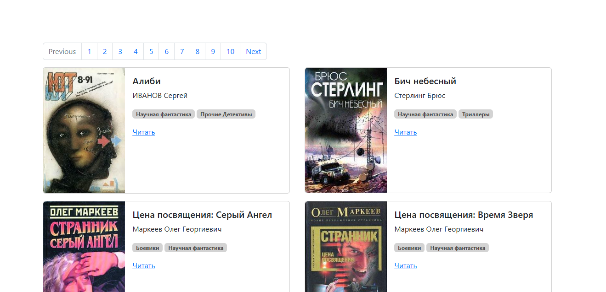

# Парсер книг с сайта tululu.org

Код с помощью которого можно создать свою мини онлайн библиотеку для того чтобы читать скачанные вами книги.

Посмотреть пример сайта можно <a href="https://1nazar1l.github.io/online-library/pages/index.html" target="_blank">здесь</a>.



### Как установить


Python3 должен быть уже установлен. Затем используйте pip (или pip3, если есть конфликт с Python2) для установки зависимостей:

```
pip install -r requirements.txt
```

### Как запустить проект


Для того чтобы запустить свою библиотеку нужно открыть терминал и написать:

```sh
python render_website.py
```

Для того чтобы изменить структуру сайта нужно зайти в `template.html`. Далее в зависимости от полученных данных книги будут рендериться на страницах `index.html`, `index2.html` и т.д. 

Количество страниц зависит от количества книг(10 книг на страницу). Если необходимо изменить количество книг на одну страницу нужно зайти в `render_website.py` и поменять значение `books_per_page`.

Чтобы скачать много книг с сайта <a href="https://tululu.org/" target="_blank">tululu.org</a> нажмите <a href="https://github.com/1nazar1l/offline-library" target="_blank">сюда</a>.

### Цель проекта

Код написан в образовательных целях на онлайн-курсе для веб-разработчиков [dvmn.org](https://dvmn.org/). 
